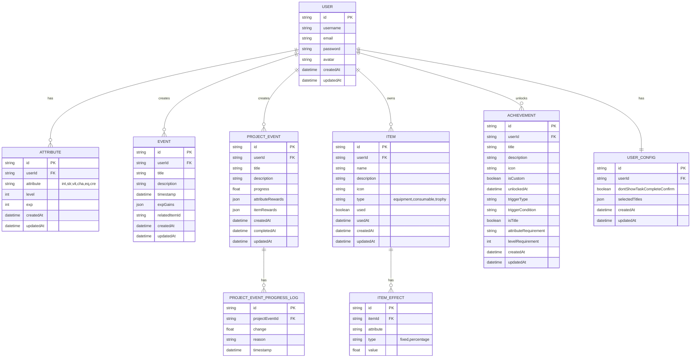

# LifeOL 后端 API 文档

## 概述

LifeOL 后端 API 为前端应用提供云端数据存储服务，替代原先基于 localStorage 的本地存储方案。API 使用 RESTful 设计风格，采用 JSON 格式进行数据交换。

## 技术栈

- **框架**: Node.js + NestJS (TypeScript)
- **数据库**: PostgreSQL
- **认证**: JWT (JSON Web Tokens)
- **API 文档**: Swagger/OpenAPI
- **ORM**: TypeORM

## 架构设计


## JWT 认证实现

### 依赖包

JWT 认证使用以下依赖包：
- `@nestjs/jwt`: NestJS 的 JWT 模块
- `@nestjs/passport`: NestJS 的 Passport 集成
- `passport-jwt`: Passport 的 JWT 策略
- `passport-local`: Passport 的本地策略（用于登录）

### 认证流程


### Token 结构

JWT token 包含三部分：
1. **Header**: 包含算法和 token 类型
2. **Payload**: 包含用户信息和声明
3. **Signature**: 用于验证 token 完整性

示例 payload:
```json
{
  "sub": "用户ID",
  "username": "用户名",
  "email": "用户邮箱",
  "iat": 1516239022,
  "exp": 1516242622
}
~~~

### 前端使用
在前端，我们创建了 apiClient.ts 工具来处理JWT认证：

登录或注册后，将token存储在localStorage中

在后续请求的Authorization头中添加Bearer token

token过期时，使用refresh token获取新token

~~~typescript
// 设置token
setToken(token: string): void {
  this.token = token;
  localStorage.setItem(APP_CONFIG.STORAGE_KEYS.AUTH_TOKEN, token);
}

// 在请求中添加认证头
if (this.token) {
  config.headers = {
    ...config.headers,
    'Authorization': `Bearer ${this.token}`,
  };
}
~~~
## API 端点

### 认证相关

#### 用户注册
```
POST /api/auth/register
```

**请求体:**
```json
{
  "username": "string",
  "email": "string",
  "password": "string"
}
```

**响应:**
```json
{
  "user": {
    "id": "string",
    "username": "string",
    "email": "string",
    "createdAt": "string"
  },
  "token": "string"
}
```

#### 用户登录
```
POST /api/auth/login
```

**请求体:**
```json
{
  "email": "string",
  "password": "string"
}
```

**响应:**
```json
{
  "user": {
    "id": "string",
    "username": "string",
    "email": "string",
    "createdAt": "string"
  },
  "token": "string"
}
```

#### 刷新令牌
```
POST /api/auth/refresh
```

**请求头:**
```
Authorization: Bearer <refresh_token>
```

**响应:**
```json
{
  "token": "string",
  "refreshToken": "string"
}
```

### 用户数据相关

#### 获取用户信息
```
GET /api/users/me
```

**请求头:**
```
Authorization: Bearer <access_token>
```

**响应:**
```json
{
  "id": "string",
  "username": "string",
  "email": "string",
  "avatar": "string",
  "createdAt": "string",
  "updatedAt": "string"
}
```

#### 更新用户信息
```
PUT /api/users/me
```

**请求头:**
```
Authorization: Bearer <access_token>
```

**请求体:**
```json
{
  "username": "string",
  "avatar": "string"
}
```

**响应:**
```json
{
  "id": "string",
  "username": "string",
  "email": "string",
  "avatar": "string",
  "createdAt": "string",
  "updatedAt": "string"
}
```

### 属性相关

#### 获取用户属性
```
GET /api/attributes
```

**请求头:**
```
Authorization: Bearer <access_token>
```

**响应:**
```json
{
  "int": { "level": 1, "exp": 0 },
  "str": { "level": 1, "exp": 0 },
  "vit": { "level": 1, "exp": 0 },
  "cha": { "level": 1, "exp": 0 },
  "eq": { "level": 1, "exp": 0 },
  "cre": { "level": 1, "exp": 0 }
}
```

#### 更新用户属性
```
PUT /api/attributes
```

**请求头:**
```
Authorization: Bearer <access_token>
```

**请求体:**
```json
{
  "int": { "level": 1, "exp": 0 },
  "str": { "level": 1, "exp": 0 },
  "vit": { "level": 1, "exp": 0 },
  "cha": { "level": 1, "exp": 0 },
  "eq": { "level": 1, "exp": 0 },
  "cre": { "level": 1, "exp": 0 }
}
```

**响应:**
```json
{
  "int": { "level": 1, "exp": 0 },
  "str": { "level": 1, "exp": 0 },
  "vit": { "level": 1, "exp": 0 },
  "cha": { "level": 1, "exp": 0 },
  "eq": { "level": 1, "exp": 0 },
  "cre": { "level": 1, "exp": 0 }
}
```

### 事件相关

#### 获取用户事件列表
```
GET /api/events
```

**请求头:**
```
Authorization: Bearer <access_token>
```

**查询参数:**
- `limit` (可选): 限制返回数量
- `offset` (可选): 偏移量
- `sortBy` (可选): 排序字段 (默认: createdAt)
- `order` (可选): 排序顺序 (默认: DESC)

**响应:**
```json
[
  {
    "id": "string",
    "title": "string",
    "description": "string",
    "timestamp": "string",
    "expGains": { "int": 0, "str": 0 },
    "relatedItemId": "string",
    "userId": "string",
    "createdAt": "string",
    "updatedAt": "string"
  }
]
```

#### 创建事件
```
POST /api/events
```

**请求头:**
```
Authorization: Bearer <access_token>
```

**请求体:**
```json
{
  "title": "string",
  "description": "string",
  "timestamp": "string",
  "expGains": { "int": 0, "str": 0 },
  "relatedItemId": "string"
}
```

**响应:**
```json
{
  "id": "string",
  "title": "string",
  "description": "string",
  "timestamp": "string",
  "expGains": { "int": 0, "str": 0 },
  "relatedItemId": "string",
  "userId": "string",
  "createdAt": "string",
  "updatedAt": "string"
}
```

#### 更新事件
```
PUT /api/events/{id}
```

**请求头:**
```
Authorization: Bearer <access_token>
```

**请求体:**
```json
{
  "title": "string",
  "description": "string",
  "timestamp": "string",
  "expGains": { "int": 0, "str": 0 },
  "relatedItemId": "string"
}
```

**响应:**
```json
{
  "id": "string",
  "title": "string",
  "description": "string",
  "timestamp": "string",
  "expGains": { "int": 0, "str": 0 },
  "relatedItemId": "string",
  "userId": "string",
  "createdAt": "string",
  "updatedAt": "string"
}
```

#### 删除事件
```
DELETE /api/events/{id}
```

**请求头:**
```
Authorization: Bearer <access_token>
```

**响应:**
```json
{
  "message": "Event deleted successfully"
}
```

### 项目事件相关

#### 获取用户项目事件列表
```
GET /api/project-events
```

**请求头:**
```
Authorization: Bearer <access_token>
```

**查询参数:**
- `limit` (可选): 限制返回数量
- `offset` (可选): 偏移量
- `status` (可选): 状态筛选 (all/active/completed)
- `sortBy` (可选): 排序字段 (默认: createdAt)
- `order` (可选): 排序顺序 (默认: DESC)

**响应:**
```json
[
  {
    "id": "string",
    "title": "string",
    "description": "string",
    "progress": 0,
    "attributeRewards": { "int": 0, "str": 0 },
    "itemRewards": ["string"],
    "createdAt": "string",
    "completedAt": "string",
    "progressLog": [
      {
        "change": 0,
        "reason": "string",
        "timestamp": "string"
      }
    ],
    "userId": "string",
    "updatedAt": "string"
  }
]
```

#### 创建项目事件
```
POST /api/project-events
```

**请求头:**
```
Authorization: Bearer <access_token>
```

**请求体:**
```json
{
  "title": "string",
  "description": "string",
  "attributeRewards": { "int": 0, "str": 0 },
  "itemRewards": ["string"]
}
```

**响应:**
```json
{
  "id": "string",
  "title": "string",
  "description": "string",
  "progress": 0,
  "attributeRewards": { "int": 0, "str": 0 },
  "itemRewards": ["string"],
  "createdAt": "string",
  "completedAt": "string",
  "progressLog": [],
  "userId": "string",
  "updatedAt": "string"
}
```

#### 更新项目事件
```
PUT /api/project-events/{id}
```

**请求头:**
```
Authorization: Bearer <access_token>
```

**请求体:**
```json
{
  "title": "string",
  "description": "string",
  "progress": 0,
  "attributeRewards": { "int": 0, "str": 0 },
  "itemRewards": ["string"]
}
```

**响应:**
```json
{
  "id": "string",
  "title": "string",
  "description": "string",
  "progress": 0,
  "attributeRewards": { "int": 0, "str": 0 },
  "itemRewards": ["string"],
  "createdAt": "string",
  "completedAt": "string",
  "progressLog": [],
  "userId": "string",
  "updatedAt": "string"
}
```

#### 更新项目事件进度
```
PATCH /api/project-events/{id}/progress
```

**请求头:**
```
Authorization: Bearer <access_token>
```

**请求体:**
```json
{
  "change": 0,
  "reason": "string"
}
```

**响应:**
```json
{
  "id": "string",
  "title": "string",
  "description": "string",
  "progress": 0,
  "attributeRewards": { "int": 0, "str": 0 },
  "itemRewards": ["string"],
  "createdAt": "string",
  "completedAt": "string",
  "progressLog": [
    {
      "change": 0,
      "reason": "string",
      "timestamp": "string"
    }
  ],
  "userId": "string",
  "updatedAt": "string"
}
```

#### 删除项目事件
```
DELETE /api/project-events/{id}
```

**请求头:**
```
Authorization: Bearer <access_token>
```

**响应:**
```json
{
  "message": "Project event deleted successfully"
}
```

### 道具相关

#### 获取用户道具列表
```
GET /api/items
```

**请求头:**
```
Authorization: Bearer <access_token>
```

**查询参数:**
- `type` (可选): 道具类型筛选 (equipment/consumable/trophy)
- `limit` (可选): 限制返回数量
- `offset` (可选): 偏移量

**响应:**
```json
[
  {
    "id": "string",
    "name": "string",
    "description": "string",
    "icon": "string",
    "type": "equipment|consumable|trophy",
    "effects": [
      {
        "attribute": "int",
        "type": "fixed|percentage",
        "value": 0
      }
    ],
    "createdAt": "string",
    "used": false,
    "usedAt": "string",
    "userId": "string",
    "updatedAt": "string"
  }
]
```

#### 创建道具
```
POST /api/items
```

**请求头:**
```
Authorization: Bearer <access_token>
```

**请求体:**
```json
{
  "name": "string",
  "description": "string",
  "icon": "string",
  "type": "equipment|consumable|trophy",
  "effects": [
    {
      "attribute": "int",
      "type": "fixed|percentage",
      "value": 0
    }
  ]
}
```

**响应:**
```json
{
  "id": "string",
  "name": "string",
  "description": "string",
  "icon": "string",
  "type": "equipment|consumable|trophy",
  "effects": [
    {
      "attribute": "int",
      "type": "fixed|percentage",
      "value": 0
    }
  ],
  "createdAt": "string",
  "used": false,
  "usedAt": "string",
  "userId": "string",
  "updatedAt": "string"
}
```

#### 更新道具
```
PUT /api/items/{id}
```

**请求头:**
```
Authorization: Bearer <access_token>
```

**请求体:**
```json
{
  "name": "string",
  "description": "string",
  "icon": "string",
  "type": "equipment|consumable|trophy",
  "effects": [
    {
      "attribute": "int",
      "type": "fixed|percentage",
      "value": 0
    }
  ]
}
```

**响应:**
```json
{
  "id": "string",
  "name": "string",
  "description": "string",
  "icon": "string",
  "type": "equipment|consumable|trophy",
  "effects": [
    {
      "attribute": "int",
      "type": "fixed|percentage",
      "value": 0
    }
  ],
  "createdAt": "string",
  "used": false,
  "usedAt": "string",
  "userId": "string",
  "updatedAt": "string"
}
```

#### 使用道具
```
POST /api/items/{id}/use
```

**请求头:**
```
Authorization: Bearer <access_token>
```

**响应:**
```json
{
  "id": "string",
  "name": "string",
  "description": "string",
  "icon": "string",
  "type": "equipment|consumable|trophy",
  "effects": [
    {
      "attribute": "int",
      "type": "fixed|percentage",
      "value": 0
    }
  ],
  "createdAt": "string",
  "used": true,
  "usedAt": "string",
  "userId": "string",
  "updatedAt": "string"
}
```

#### 删除道具
```
DELETE /api/items/{id}
```

**请求头:**
```
Authorization: Bearer <access_token>
```

**响应:**
```json
{
  "message": "Item deleted successfully"
}
```

### 成就相关

#### 获取用户成就列表
```
GET /api/achievements
```

**请求头:**
```
Authorization: Bearer <access_token>
```

**查询参数:**
- `status` (可选): 状态筛选 (all/unlocked/locked)
- `type` (可选): 类型筛选 (system/custom/title)

**响应:**
```json
[
  {
    "id": "string",
    "title": "string",
    "description": "string",
    "icon": "string",
    "isCustom": false,
    "unlockedAt": "string",
    "triggerType": "string",
    "triggerCondition": "string",
    "isTitle": false,
    "attributeRequirement": "int",
    "levelRequirement": 0,
    "userId": "string",
    "createdAt": "string",
    "updatedAt": "string"
  }
]
```

#### 创建自定义成就
```
POST /api/achievements
```

**请求头:**
```
Authorization: Bearer <access_token>
```

**请求体:**
```json
{
  "title": "string",
  "description": "string",
  "icon": "string",
  "triggerType": "string",
  "triggerCondition": "string"
}
```

**响应:**
```json
{
  "id": "string",
  "title": "string",
  "description": "string",
  "icon": "string",
  "isCustom": true,
  "unlockedAt": null,
  "triggerType": "string",
  "triggerCondition": "string",
  "isTitle": false,
  "attributeRequirement": null,
  "levelRequirement": null,
  "userId": "string",
  "createdAt": "string",
  "updatedAt": "string"
}
```

#### 更新成就状态（解锁成就）
```
PATCH /api/achievements/{id}/unlock
```

**请求头:**
```
Authorization: Bearer <access_token>
```

**响应:**
```json
{
  "id": "string",
  "title": "string",
  "description": "string",
  "icon": "string",
  "isCustom": false,
  "unlockedAt": "string",
  "triggerType": "string",
  "triggerCondition": "string",
  "isTitle": false,
  "attributeRequirement": "int",
  "levelRequirement": 0,
  "userId": "string",
  "createdAt": "string",
  "updatedAt": "string"
}
```

#### 删除自定义成就
```
DELETE /api/achievements/{id}
```

**请求头:**
```
Authorization: Bearer <access_token>
```

**响应:**
```json
{
  "message": "Achievement deleted successfully"
}
```

### 配置相关

#### 获取用户配置
```
GET /api/config
```

**请求头:**
```
Authorization: Bearer <access_token>
```

**响应:**
```json
{
  "id": "string",
  "dontShowTaskCompleteConfirm": false,
  "selectedTitles": ["string"],
  "userId": "string",
  "createdAt": "string",
  "updatedAt": "string"
}
```

#### 更新用户配置
```
PUT /api/config
```

**请求头:**
```
Authorization: Bearer <access_token>
```

**请求体:**
```json
{
  "dontShowTaskCompleteConfirm": false,
  "selectedTitles": ["string"]
}
```

**响应:**
```json
{
  "id": "string",
  "dontShowTaskCompleteConfirm": false,
  "selectedTitles": ["string"],
  "userId": "string",
  "createdAt": "string",
  "updatedAt": "string"
}
```

### 数据导入导出相关

#### 导出用户所有数据
```
GET /api/data/export
```

**请求头:**
```
Authorization: Bearer <access_token>
```

**响应:**
```json
{
  "version": "1.0.0",
  "exportDate": "string",
  "attributes": {
    "int": { "level": 1, "exp": 0 },
    "str": { "level": 1, "exp": 0 },
    "vit": { "level": 1, "exp": 0 },
    "cha": { "level": 1, "exp": 0 },
    "eq": { "level": 1, "exp": 0 },
    "cre": { "level": 1, "exp": 0 }
  },
  "events": [],
  "achievements": [],
  "items": [],
  "projectEvents": [],
  "selectedTitles": [],
  "userConfig": {
    "username": "string",
    "avatar": "string"
  }
}
```

#### 导入用户数据
```
POST /api/data/import
```

**请求头:**
```
Authorization: Bearer <access_token>
Content-Type: multipart/form-data
```

**请求体:**
```
file: (JSON文件)
```

**响应:**
```json
{
  "message": "Data imported successfully"
}
```

## 错误响应格式

所有错误响应都遵循以下格式:

```json
{
  "statusCode": 400,
  "message": "错误描述",
  "error": "Bad Request"
}
```

常见的错误状态码:
- 400: 请求参数错误
- 401: 未授权访问
- 403: 禁止访问
- 404: 资源未找到
- 500: 服务器内部错误

## 认证机制

所有需要用户身份的 API 端点都需要在请求头中包含有效的 JWT token:

```
Authorization: Bearer <access_token>
```

## 数据模型关系图



## 部署说明

### 环境变量

```env
# 数据库配置
DB_HOST=localhost
DB_PORT=5432
DB_USERNAME=lifeol
DB_PASSWORD=password
DB_NAME=lifeol

# JWT 配置
JWT_SECRET=your_jwt_secret_key
JWT_EXPIRES_IN=3600s
JWT_REFRESH_EXPIRES_IN=7d

# 应用配置
PORT=3001
NODE_ENV=production
```

### 启动命令

```bash
# 安装依赖
npm install

# 运行数据库迁移
npm run migration:run

# 启动开发服务器
npm run start:dev

# 启动生产服务器
npm run start:prod
```

## API 版本控制

当前 API 版本: v1

所有 API 端点都以 `/api/v1/` 为前缀，例如:
```
POST /api/v1/auth/register
GET /api/v1/users/me
```