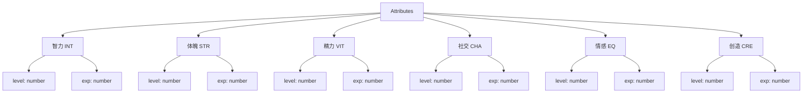
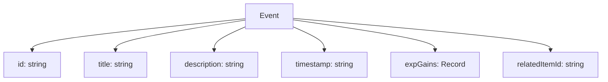
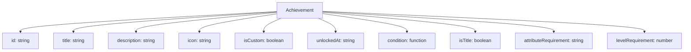
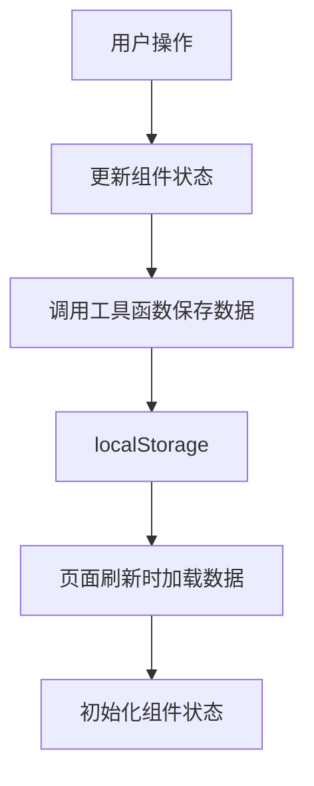

# LifeOL 前端开发文档

## 项目概述

LifeOL（人生Online）是一个将生活游戏化的应用程序，旨在通过角色扮演游戏（RPG）的机制来量化和可视化用户的个人成长。用户可以通过记录生活事件来提升六大核心属性（智力、体魄、精力、社交、情感、创造），并解锁成就，使用道具等。

## 技术栈

- **框架**: React + TypeScript
- **构建工具**: Vite
- **状态管理**: React 内置状态管理 (useState, useEffect)
- **样式**: Tailwind CSS
- **包管理**: npm

## 项目结构

```
frontend/
├── src/
│   ├── components/     # React 组件
│   ├── utils/          # 工具函数
│   ├── types/          # TypeScript 类型定义
│   ├── trickle/        # 业务规则和文档
│   └── app.tsx         # 主应用组件
├── public/             # 静态资源
├── index.html          # HTML 模板
├── main.tsx            # 应用入口
├── vite.config.ts      # Vite 配置
├── tsconfig.json       # TypeScript 配置
└── tailwind.config.js  # Tailwind CSS 配置
```

## 核心模块

### 1. 属性系统 (Attributes System)

用户拥有六大核心属性，每个属性都有等级和经验值：

- 智力 (INT) - 🧠
- 体魄 (STR) - 💪
- 精力 (VIT) - ⚡
- 社交 (CHA) - 👥
- 情感 (EQ) - ❤️
- 创造 (CRE) - 🎨



### 2. 事件系统 (Events System)

用户可以记录生活中的事件，并为相关属性获得经验值。



### 3. 项目事件系统 (Project Events System)

项目事件是长期目标，用户可以跟踪进度并最终完成。

```mermaid
graph TD
    A[ProjectEvent] --> B[id: string]
    A --> C[title: string]
    A --> D[description: string]
    A --> E[progress: number]
    A --> F[attributeRewards: Record]
    A --> G[itemRewards: string[]]
    A --> H[createdAt: string]
    A --> I[completedAt: string]
    A --> J[progressLog: ProjectEventProgressLog[]]
```

### 4. 道具系统 (Items System)

用户可以获得和使用道具，分为装备、消耗品和收藏品三种类型。

```mermaid
graph TD
    A[Item] --> B[id: string]
    A --> C[name: string]
    A --> D[description: string]
    A --> E[icon: string]
    A --> F[type: equipment/consumable/trophy]
    A --> G[effects: ItemEffect[]]
    A --> H[createdAt: string]
    A --> I[used: boolean]
    A --> J[usedAt: string]
```

### 5. 成就系统 (Achievements System)

用户通过完成特定目标解锁成就。



## 数据存储

应用使用 localStorage 进行数据持久化存储，主要包含以下键值：

- `lifeol_attributes`: 用户属性数据
- `lifeol_events`: 用户事件数据
- `lifeol_achievements`: 用户成就数据
- `lifeol_items`: 用户道具数据
- `lifeol_project_events`: 用户项目事件数据
- `lifeol_consumable_usage`: 消耗品使用记录
- `lifeol_selected_titles`: 用户选择的称号
- `lifeol_user_config`: 用户配置
- `lifeol_auth_token`: 用户认证token
- `lifeol_refresh_token`: 刷新token

## 核心组件

### App 组件

主应用组件，负责状态管理和协调各子组件。

### Header 组件

应用头部，包含导航和用户菜单。

### StatsOverview 组件

统计概览，显示用户属性雷达图和等级信息。

### StatusPanel 组件

状态面板，显示详细属性信息和相关操作。

### EventManager 组件

事件管理器，用于创建和管理生活事件。

### ProjectEventManager 组件

项目事件管理器，用于创建和跟踪长期目标。

### ItemSystem 组件

道具系统，显示和管理用户拥有的道具。

### AchievementSystem 组件

成就系统，展示已解锁和未解锁的成就。

### TaskManager 组件

任务管理器，用于管理日常任务。

## 工具函数

### storage.ts

负责数据的保存和加载操作。

### achievements.ts

成就相关的逻辑处理，包括成就检查和进度计算。

### calculations.ts

数值计算相关函数，如等级计算等。

### userConfig.ts

用户配置管理。

### dataImportExport.ts

数据导入导出功能。

### apiClient.ts

与后端API通信的客户端。

## 开发流程

### 环境搭建

1. 安装依赖：
```bash
npm install
```

2. 启动开发服务器：
```bash
npm run dev
```

3. 构建生产版本：
```bash
npm run build
```

4. 预览生产构建：
```bash
npm run preview
```

### 添加新功能

1. 在 [types/app.types.ts](file:///d:/Desktop/Develop/LifeOL/frontend/src/types/app.types.ts) 中定义相关类型
2. 创建或修改组件文件
3. 添加必要的工具函数
4. 在主应用组件中集成新功能

### 数据流



## 后端集成

### API 客户端

项目包含一个 API 客户端 ([apiClient.ts](file:///d:/Desktop/Develop/LifeOL/frontend/src/utils/apiClient.ts))，用于与后端服务通信。

### 认证流程

1. 用户注册或登录
2. 后端返回 JWT token
3. 客户端存储 token 并在后续请求中使用
4. Token 过期时自动刷新

### 数据同步

前端应用支持两种数据存储模式：

1. **本地模式**: 使用 localStorage 存储所有数据
2. **云端模式**: 与后端 API 同步数据

未来将实现完整的云端同步功能，用户数据将存储在后端数据库中。

## 最佳实践

1. **类型安全**: 充分利用 TypeScript 的类型系统确保代码质量
2. **组件化**: 将功能拆分为独立的可复用组件
3. **状态管理**: 合理使用 React 状态管理，避免不必要的重渲染
4. **错误处理**: 为所有可能出错的操作添加适当的错误处理
5. **本地存储**: 对所有 localStorage 操作进行 try-catch 包装

## 扩展性考虑

1. **后端集成**: 当前使用 localStorage，未来可轻松替换为 REST API 调用
2. **模块化设计**: 各功能模块相对独立，便于扩展和维护
3. **配置管理**: 通过全局配置文件管理应用设置，便于维护

## 常见问题

### 如何添加新的属性？

1. 在 [types/app.types.ts](file:///d:/Desktop/Develop/LifeOL/frontend/src/types/app.types.ts) 中的 [Attributes](file:///d:/Desktop/Develop/LifeOL/frontend/src/types/app.types.ts#L5-L12) 接口添加新属性
2. 在 [storage.ts](file:///d:/Desktop/Develop/LifeOL/frontend/src/utils/storage.ts) 的 [getInitialAttributes](file:///d:/Desktop/Develop/LifeOL/frontend/src/utils/storage.ts#L56-L65) 函数中添加初始值
3. 更新相关的计算和显示逻辑

### 如何添加新的成就类型？

1. 在 [types/app.types.ts](file:///d:/Desktop/Develop/LifeOL/frontend/src/types/app.types.ts) 中的 [Achievement](file:///d:/Desktop/Develop/LifeOL/frontend/src/types/app.types.ts#L44-L58) 接口添加新的字段
2. 在 [achievements.ts](file:///d:/Desktop/Develop/LifeOL/frontend/src/utils/achievements.ts) 中更新成就检查逻辑
3. 更新成就显示组件以处理新的成就类型