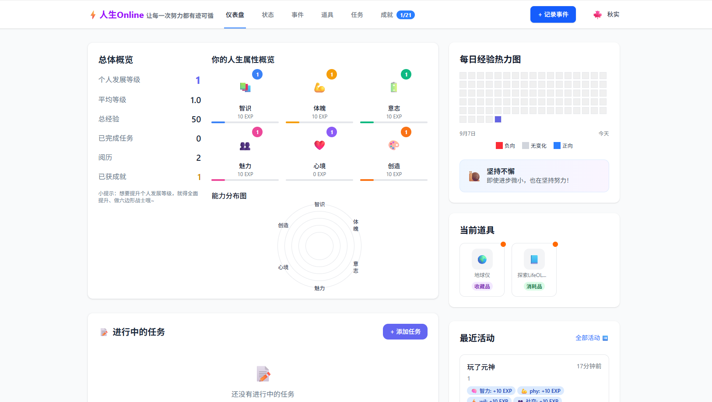

# 人生Online (Life Online)

[](https://opensource.org/licenses/MIT)
[](https://github.com/your-username/life-online)
[](https://github.com/your-username/life-online/pulls)

**将生活游戏化，让每一次努力都有迹可循，让每一份成长都清晰可见。**

---
LifeOL仍在开发当中，不完整的功能请多多包涵~

欢迎提交pr一起开发呀

# 启动方式
1.安装依赖:
在项目根目录下运行：
```Bash
npm install
```
这会安装根目录以及 workspaces (frontend/backend) 的所有依赖。
启动前端:
```Bash
npm run dev:frontend
```
或者进入 frontend 目录运行 `npm run dev`  
访问: http://localhost:3000 (或终端显示的端口)即可看到程序运行啦。

---
# 项目介绍
### 目录 (Table of Contents)

- [人生Online (Life Online)](#人生online-life-online)
  - [](#)
- [启动方式](#启动方式)
- [项目介绍](#项目介绍)
    - [目录 (Table of Contents)](#目录-table-of-contents)
    - [🌟 项目愿景 (Project Vision)](#-项目愿景-project-vision)
    - [✨ 核心功能 (Core Features)](#-核心功能-core-features)
    - [🎨 设计理念 (Design Philosophy)](#-设计理念-design-philosophy)
    - [💻 技术栈 (Tech Stack)](#-技术栈-tech-stack)
    - [🚀 路线图 (Roadmap)](#-路线图-roadmap)
    - [🤝 如何贡献 (How to Contribute)](#-如何贡献-how-to-contribute)
    - [📝 许可证 (License)](#-许可证-license)

---

### 🌟 项目愿景 (Project Vision)

在现实生活中，我们的成长和努力往往是抽象且难以量化的。我们付出了时间，却不一定能立即看到回报，这容易导致迷茫和动力不足。"人生Online" 旨在解决这一痛点。

我们通过引入角色扮演游戏（RPG）的升级和反馈机制，将您的人生打造成一场充满乐趣的“在线游戏”。在这里，每一次阅读、锻炼、社交或创作，都将转化为实实在在的**经验值 (EXP)**，提升您角色的各项**属性**。您不仅是在完成任务，更是在记录、回顾和珍藏自己独一无二的人生轨迹。

**我们的目标是：为您提供一个的人生仪表盘和记忆收藏夹，让您在经营生活的旅程中，既有方向，又有回响。**

### ✨ 核心功能 (Core Features)

-   **👤 角色面板 (Character Sheet)**
    -   **六大核心属性**: 智力 (INT)、体魄 (STR)、精力 (VIT)、社交 (CHA)、情感 (EQ)、创造 (CRE)。
    -   **经验与等级**: 每个属性拥有独立的经验条与等级系统。
    -   **可视化雷达图**: 直观展示您的能力分布，帮助您发现长处与待提升的领域。

-   **📝 事件与任务 (Events & Quests)**
    -   **即时记录**: 随时随地记录生活中的点滴事件，并将其与属性关联，获得EXP。
    -   **目标与习惯**: 设定每日、每周的重复性目标（如“晨跑”、“阅读”），轻松打卡，自动化成长。
    -   **图文日志**: 为每个事件添加文字感悟和图片，构建您的私人日记。

-   **🏆 成就与回顾 (Achievements & Memories)**
    -   **成就系统**: 通过达成特定目标（如“智力达到Lv.10”、“连续健身7天”）解锁精美徽章，获得满满成就感。
    -   **人生时间轴**: 以优美的瀑布流形式回顾您记录的所有事件，您的每一天都值得被铭记。
    -   **数据报告**: 生成可视化周报、月报、年报，量化您的成长历程。

-   **🤖 AI 伴侣 "小O" (AI Companion "Echo")**
    -   **智能建议**: 基于您的属性状态和记录，提供个性化的生活与成长建议。
    -   **暖心总结**: 定期为您生成充满鼓励的成长小结。
    -   **目标规划**: 辅助您设定清晰、可达成的目标。

### 🎨 设计理念 (Design Philosophy)

-   **界面**: 简约、现代，富有生活气息，避免过度游戏化的视觉干扰。
-   **交互**: 操作简单直观，全年龄段用户都能轻松上手。
-   **动画**: 舒适、流畅、有意义。我们追求的是“恰到好处”的正向反馈，而非“喧宾夺主”的特效。

### 💻 技术栈 (Tech Stack)

我们选择现代化的跨平台技术栈，以实现高效开发与卓越用户体验。

-   **前端 (Client)**: **React + TypeScript + Vite** (现代化Web技术栈，支持跨平台访问)
-   **后端 (Server)**: **Node.js + NestJS** (TypeScript)
-   **数据库 (Database)**: **PostgreSQL**
-   **云服务 (Cloud)**: AWS / GCP / Azure
-   **AI**: 初期采用**规则与模板**，中期逐步演进至**微调后的大语言模型 (LLM)**。

### 🚀 路线图 (Roadmap)

项目目前处于 **规划阶段**。我们将分阶段进行开发：

-   **Phase 1: MVP (最小可行产品)** ✔已实现
    -   **目标**: 验证核心玩法。
    -   **内容**: 核心属性、事件记录
    -   **平台**: Android & Windows。

-   **Phase 2: 功能增强**
    -   **目标**: 丰富激励与回顾体系、云端同步和更好的用户体验。
    -   **内容**: 成就系统、目标/习惯打卡、数据报告、云端同步、事件模板（用户可以创建自己的事件模板，比如“运动模板”-“高运动量“对应体魄+20、“低运动量“对应体魄+10等的模板化操作）、撤销/删除事件功能（会退回该时间未解锁的状态、成就也会恢复）、周期条件事件（比如连续7天运动，就可以触发额外体魄+10的事件；再比如7天无读书，就会导致智力-10）、加入负面事件（用户可以提出负向的增益值，对相应属性有负向调整）

-   **Phase 3: 智能化与社交**
    -   **目标**: 引入AI与正向社交元素。
    -   **内容**: AI伴侣 V1.0、报告分享功能。

-   **未来**: 支持更多平台 (iOS/Web)、高级AI功能、可穿戴设备联动等。

### 🤝 如何贡献 (How to Contribute)

我们非常欢迎志同道合的开发者、设计师和产品爱好者加入我们，共同打造这款应用！

1.  **Fork** 本仓库。
2.  创建您的功能分支 (`git checkout -b feature/YourAmazingFeature`)。
3.  提交您的更改 (`git commit -m 'Add some AmazingFeature'`)。
4.  将您的分支推送到远程仓库 (`git push origin feature/YourAmazingFeature`)。
5.  创建一个新的 **Pull Request**。

请确保您的代码遵循现有代码风格，并提供充分的测试。

### 📝 许可证 (License)

本项目采用 [MIT License](LICENSE.md) 许可证。